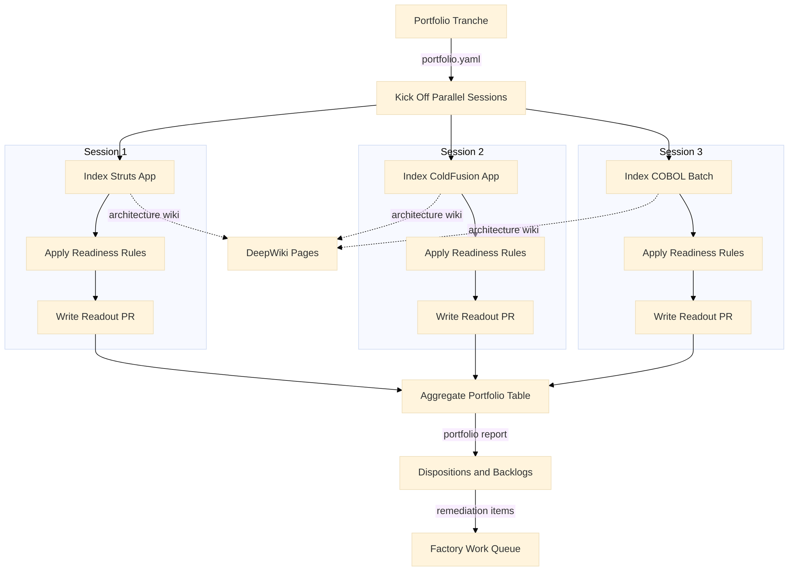
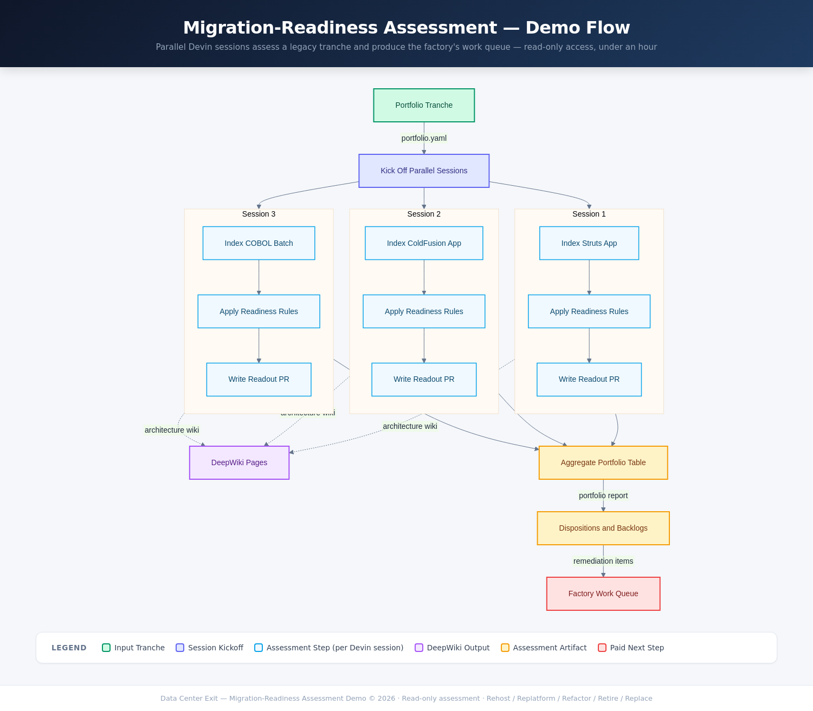

# Migration-Readiness Assessment Demo — Data Center Exit

Parallel Devin sessions assess a representative tranche of legacy applications for cloud readiness — producing, with read-only access and in under an hour, the disposition-and-backlog artifact a large SI would take months to deliver.



Interactive version: [docs/flowchart.html](docs/flowchart.html)

<details>
<summary>Flowchart (PNG fallback)</summary>



</details>

## What this demo shows

A manufacturer is exiting a data center and must classify ~2,000
applications for cloud migration. Nobody fully knows what the legacy
estate does, and the per-application assessment is what SIs charge months
and millions for. This demo runs that assessment on a representative
3-app tranche — Java/Struts, ColdFusion, and COBOL — with parallel Devin
sessions that need only **read access**, and the customer owns every
artifact produced.

## What Devin does live

The presenter kicks off one Devin session per tranche app. Each session
clones its repo, confirms it in DeepWiki (a browsable architecture wiki
materializes per app), applies the cloud-readiness ruleset in
`rules/cloud-readiness-rules.yaml`, and opens a PR against this repo with
a readout: behavioral summary, findings with `file:line` evidence (EOL
runtimes, vulnerable dependencies, hardcoded hostnames, file-system
coupling, plaintext credentials, missing tests), a sized remediation
backlog, and a rehost/replatform/refactor/retire/replace disposition. A
coordinator session then aggregates the readouts into the portfolio
disposition table and a static HTML report. The audience watches the SI
assessment artifact materialize in PRs, in parallel, in under an hour.

## How the demo runs

1. **Trigger** — in a fresh Devin session, prompt: *"Run the
   migration-readiness assessment in `playbooks/
   migration-readiness-assessment.md` over every app in `portfolio.yaml`,
   one child session per app, then aggregate the readouts."* Devin spawns
   the parallel child sessions itself.
2. **Per-app sessions** (parallel) — each assesses its repo read-only and
   opens a readout PR to `assessment/readouts/<app_id>.md`.
3. **Aggregation** — the coordinator session merges the readout PRs, runs
   `scripts/aggregate_readouts.py`, and shows the portfolio disposition
   table plus `assessment/portfolio_report.html`.
4. **Outputs the audience sees** — readout PRs appearing in parallel,
   DeepWiki pages per app, and the final portfolio table. The backlogs
   are the migration factory's work queue.

## The tranche

| App | Repo | Stack |
|---|---|---|
| Supplier Quality Portal | [legacy-supplier-portal](https://github.com/tedfoley-cog/legacy-supplier-portal) | Java 7 / Struts 1.2 / Tomcat 6 / MySQL 5.5 |
| Facilities Work Order Tracker | [legacy-workorder-cf](https://github.com/tedfoley-cog/legacy-workorder-cf) | Adobe ColdFusion 9 / Win 2008 R2 / Oracle 11g |
| Materials Inventory Batch | [legacy-inventory-cobol](https://github.com/tedfoley-cog/legacy-inventory-cobol) | Enterprise COBOL / z/OS / VSAM / CA-7 |

## Repo layout

```
portfolio.yaml                  # the tranche (one entry per parallel session)
playbooks/                      # per-session assessment playbook
rules/cloud-readiness-rules.yaml# Konveyor-style readiness ruleset
assessment/READOUT_TEMPLATE.md  # readout structure
assessment/readouts/            # sessions write readouts here live
scripts/aggregate_readouts.py   # portfolio table + HTML report
docs/                           # implementation plan + flowchart
```

## Key concepts

| Term | Meaning |
|---|---|
| Disposition | Migration strategy per app: rehost, replatform, refactor, retire, replace |
| Blocker | Finding that must be remediated before the app can land in cloud |
| Environmental coupling | Hardcoded hostnames, file mounts, OS scheduled jobs that assume the data center |
| Characterization tests | Tests written against current behavior before any change — phase zero of remediation |
| Wave | A batch of apps migrated together, sequenced by readiness and coupling |
| Factory work queue | The union of all remediation backlogs — the paid next step |
